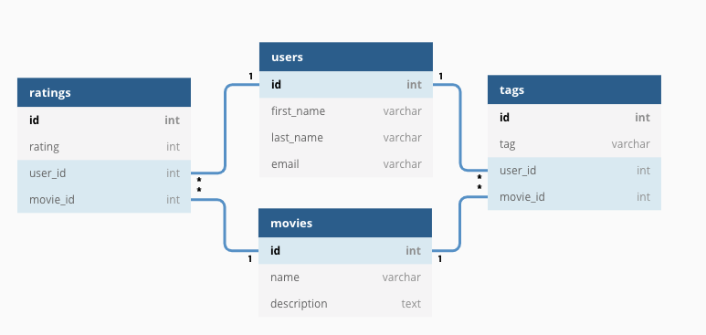
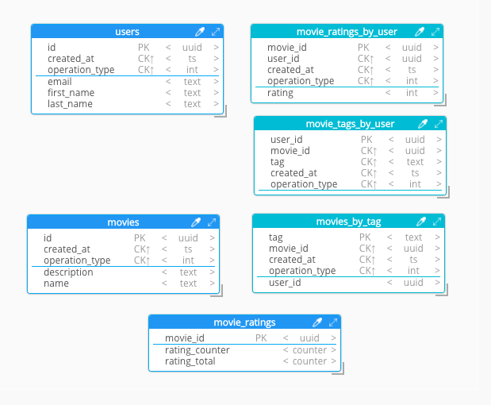
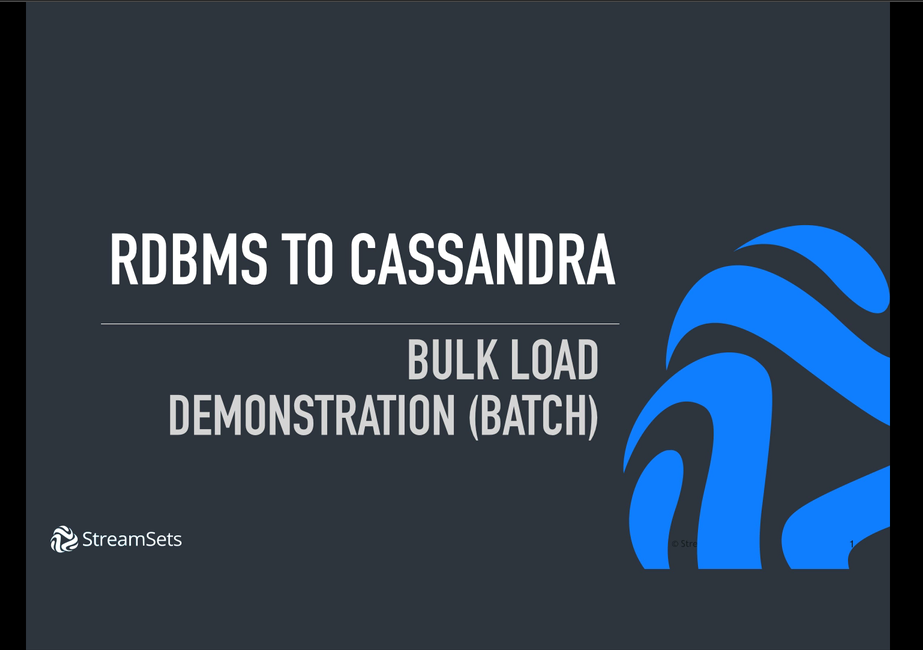
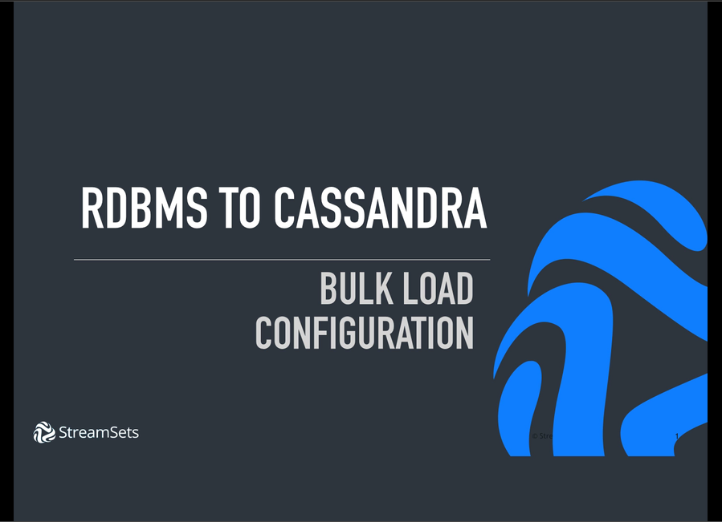
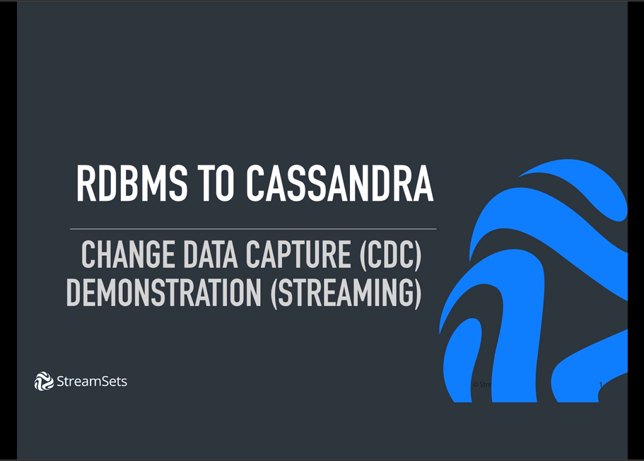
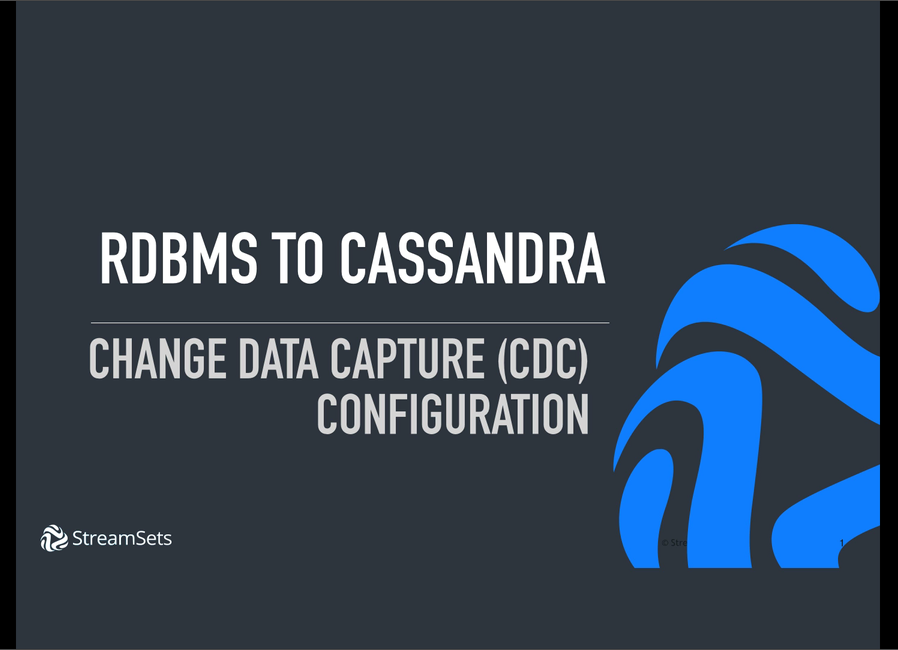

## DataStax or Cassandra Ingest from Relational Databases with StreamSets

How do you ingest from an existing relational database (RDBMS) to Cassandra?  

Or, how about ingesting from a RDBMS to a Kerberized DataStax cluster?  

What about a one-time batch load of historical data vs streaming changes?

I know what some of you are thinking, write and deploy some code.  And maybe the code can utilize a framework like Apache Spark.  That's what I would have thought a few years ago. But, it often turns out that's not as easy as expected.  

Don't get me wrong, writing and deploying code makes much sense for some folks.  But for many others, writing and deploying custom code may require a significant time and resources.  

Are there any alternatives to custom code for Cassandra ingestion from a RDBMS?

For example, are there any third party tools available which focus on data ingestion?  And if so, do they support Cassandra or DataStax from an RDBMS?  

Yes and Yes with StreamSets Data Collector or StreamSets Control Hub.  

In this tutorial, we'll explore how you can use the open source StreamSets Data Collector for migrating from an existing RDBMS to DataStax or Cassandra.

We're going to cover the both **_batch_** and **_streaming_** based data ingestion from a RDBMS to Cassandra:

* **Use Case 1**: Initial Bulk Load of historical RDBMS based data into Cassandra (batch)

* **Use Case 2**: Change Data Capture (aka CDC) trickle feed from RDBMS to Cassandra to keep Cassandra updated in near real-time (streaming)

#### Why this matters?

* Migrate to Cassandra more quickly than writing a custom code solution

* Build confidence in your Cassandra data models and operations using real-world data

* Switch-over from a RDBMS based environment to Cassandra with minimum downtown (in fact, no downtime is possible.  keep reading.)

* Utilize a tool built for data ingest, so you can focus on your business objectives which rely on Cassandra.  You're not in the data ingest business, right?  So why build something when you don't have to.  Prioritize.

## Our Approach

I'm going to riff off the world famous Killrvideo.  Specifically, in this tutorial we're going to present and solve for a migrating a RDBMS called Killrmovies to Cassandra.  Killrmovies is a subset of the Killrvideo schema and will work well when highlighting the differences in data models.

In other words, what can we do if we are migrating to DataStax or Cassandra from an RDBMS and not building something entirely new?

Before we begin, you might be wondering why I named it Killrmovies?  Yeah, I know, I know, not the most original name.  I'm open to other ideas and considered alternatives such as SweetMovies, KickButtVideos and DopeVids, but we're going with Killrmovies for now.  

Killrmovies RDBMS data model is traditional, 3NF where normalization is paramount.

Conversely, when moving to Cassandra, the data model is based on known queries with denormalized data.  

   

We're leveraging a subset of Killrvideo because it's often used when introducing and teaching data modeling in DataStax and Cassandra.  And this especially relevant in this tutorial where we are taking an existing RDBMS based model and migrating to Cassandra.

I'm assuming you know Killrvideo!  If not, just search for it.  

### Requirements

1. Cassandra or DataStax Enterprise (DSE).  (see  schema/cassandra_schema.cql file)

2. A RDBMS with a JDBC driver such as Oracle, Microsoft SQL Server, PostgreSQL or mySQL. (this tutorial uses mySQL.)

3. StreamSets Data Collector 3.4 or above

_Please note_: If you are new to StreamSets, you are encouraged to visit http://www.streamsets.com to learn more and complete the Basic Tutorials available at https://streamsets.com/tutorials/ before attempting this tutorial.

### Use Case 1 - Bulk Loading Cassandra from RDBMS

Let's work backwards.  What does the end result of bulk loading into Cassandra from a RDBMS with StreamSets look like?

In the following screencast, I demonstrate how to run the provided StreamSets bulk load pipeline.  Along the way, we'll review the before and after state of the mySQL database and Cassandra.

#### Key Deliverables

In the demonstration, we saw the ability to move from a data model appropriate for RDBMS to a data model appropriate for Cassandra without writing any code. Instead we utilized StreamSets configuration as code.  That's an important point.  StreamSets Data Collector is not a code generator.  It is design tool and execution engine.  As we saw in the pipeline import, pipelines are represented in JSON config.  

**_Bonus Points_** In addition, did you notice we addressed auto-incrementing primary keys in RDBMS to `uuid` fields in Cassandra?  The construct of auto-incrementing primary keys do not hold a similar position with distributed databases.

#### StreamSets configuration

How should we configure StreamSets for this bulk load use case?

### Use Case 2 - Change Data Capture to Cassandra

In databases, change data capture (CDC) is a set of software design patterns used to determine (and track) the data that has changed so that action can be taken using the changed data. [1]

In other words, for this tutorial, a mySQL CDC origin will allow us to determine the insert, update or delete mutations in near real-time in order to translate these operations into our Cassandra destination.

StreamSets has many out-of-the-box options for CDC enabled databases including Oracle, Microsoft SQL Server, Mongo, PostgreSQL and mySQL. [2]

When implementing CDC patterns, you usually start with a few high-level choices:

* Do you want to perform logical or physical deletes from origin to destination?  Depends on design of origin.  Is the origin performing physical deletes? Logical deletes are often referred to as "soft deletes" where a column is updated to indicate if a record has been deleted or not; i.e. a boolean `deleted` column or an `operation_type` column indicator.  

* Do you want to perform logical or physical updates?  When an update happens at the source RDBMS, do you want to update the record in the destination or do you want to write a new record with a logical update.  As an example of logical update, you may have a data model with an `operation_type` column with int value indicators for INSERT, UPDATE or DELETE.  An `operation_type` column is often paired with with a `created_at` timestamp column.  These two columns would allow you to have a running history of updates to a particular entity.  (or even deletes if you choose)

You have options. In this tutorial, we're going to implement the logical instead of physical approach when collecting RDBMS mutations to the Cassandra destination.

In the logical approach, we will be retaining a history of source mutations. See FAQ section below for alternatives.

Let's take a look at example

#### Key Deliverables

In this second data pipeline example, we showed CDC from mySQL to Cassandra using a **_streaming_** pipeline.  This is different from the first example which was a one-time **_batch_** pipeline.  This pipeline is intended to run continuously.  

We chose the approach of logical updates and deletes vs. physical.

#### StreamSets Configuration

Let's review how this pipeline is configured in the following screencast

### Conclusion

In this tutorial, you saw how to batch load and stream changes from a RDBMS to Cassandra using StreamSets.  If you have any questions or suggestions for improvement, let me know!

#### FAQ

1. What if my RDBMS has too many tables to address in a StreamSets pipeline or I want to organize into multiple pipelines?

__Solution__ Break up into multiple pipelines and filter accordingly.  You can filter in both the Bulk Ingest pipeline as well as the CDC origin pipeline:

To filter in `JDBC Multitable` origin, configure the `Tables` tab.  This tutorial has filters for the `movies` and `users` tables.  You can use wildcards and exclusion patterns if needed.

To filter in `mySQL bin log` CDC origin, look in the `Advanced` tab, in the `Include Tables` and `Ignore Tables` config options.

2. What if I want to perform physical deletes vs. logical?

Update your pipeline or create a new pipeline especially for deletes.  Use the `JDBC Executor` or `JDBC Producer` stage configured with a Cassandra JDBC driver to issue the dynamically constructed `delete` queries.

3. What if I want to perform physical updates vs. logical?

In this case, simply update your StreamSets pipeline and Cassandra data model to remove the `created_at` and `operation_type` fields. An existing record in Cassandra will be updated (upsert).  The `cassandra_schema_no_history.cql` file has this model all ready for you.  Note: you'll need to address deletes or sdc.operation.type == 2 in your pipeline with this model.

### Source

https://github.com/tmcgrath/cassandra-ingest

RDBMS data model created with https://dbdiagram.io

Cassandra/DataStax data model created with https://hackolade.com

### References

[1] [What is Change Data Capture?](https://en.wikipedia.org/wiki/Change_data_capture)

[2] [Change Data Capture (CDC) with StreamSets documentation](https://streamsets.com/documentation/datacollector/3.4.0/help/datacollector/UserGuide/Pipeline_Design/CDC-Overview.html?hl=cdc)

[3] [Configuring mySQL binlog for CDC](https://github.com/tmcgrath/cassandra-ingest/wiki/Configuring-mySQL-binlog-Change-Data-Capture-Environment-Configuration)

#### Notes & Possible Improvement Ideas

* Docker container with all of this and maybe even using DataStax

* Different source example; i.e. use Oracle or some other source for both pipelines  

* Implement a Stream Processor pipeline with Kafka, Pulsar or Kinesis.  Example: 1 pipeline for batch and streaming cdc pipelines to Kafka and 1 pipeline from Kafka to Cassandra.  

* Others?
